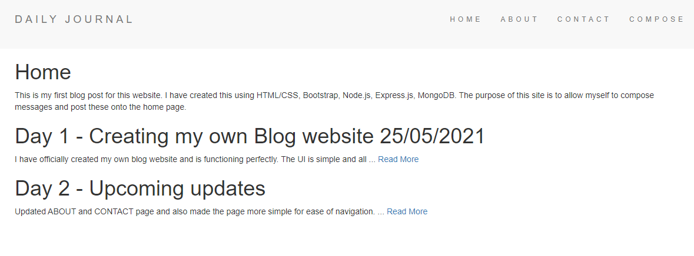
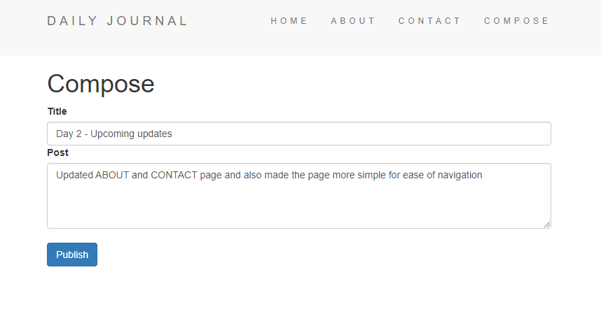
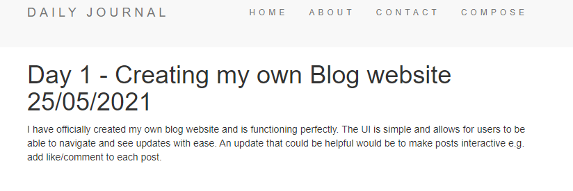

# Blog-website

The applciation was built using Bootstrap (Frontend), Node.js, Express along with EJS(Backend). It uses MongoDB for database and styled with Bootstrap 4.

  

Home page:

Compose page:

Read more page:

<h1>Instructions & How to use the app </h1>
<ol>
  <li>cd into the app root directory in your terminal</li>
  <li>Create a local database (I used MongoDB) blogDB</li>
  <li>Run npm i command</li>
  <li>open app in browser on localhost:3000</li>
  </ol>
  

<h1>Summary</h1>
This web application was developed to enhance my understanding of NodeJS and Express along with MongoDB, using Bootstrap for styling and responsiveness of the application while the backend uses Node.js, Express and EJS for dynamic browsing. The MongoDB is being used to handle storing individual posts and displaying them on the home page.

<h1>Technologies/Design</h1>
<ul>
  <li>HTML, CSS, JavaScript - Front End Stack</li>
  <li>Node.js and Express.js - Backend Stack</li>
  <li>EJS</li>
  <li>MongoDB - Database</li>
  </ul>

<h1>Author</h1>
Ibrahim Akbar

